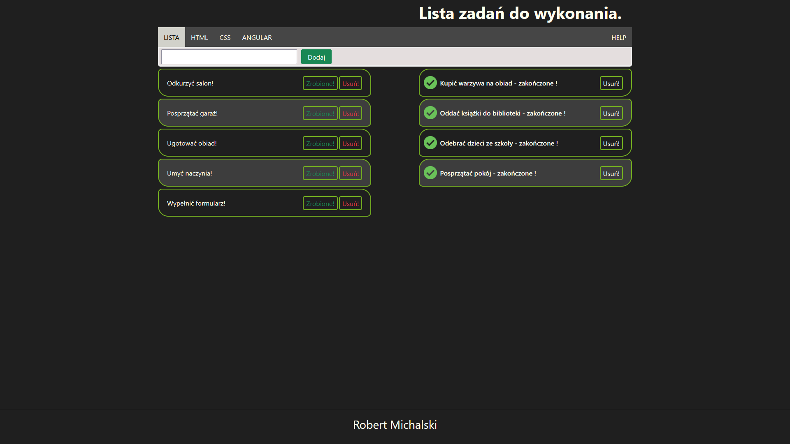
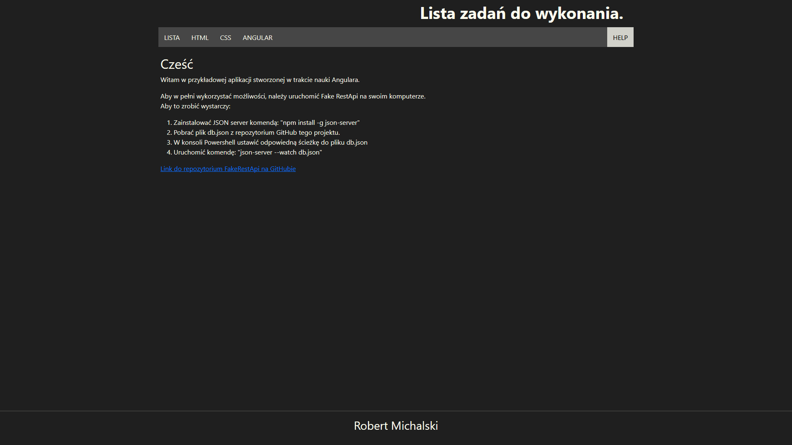
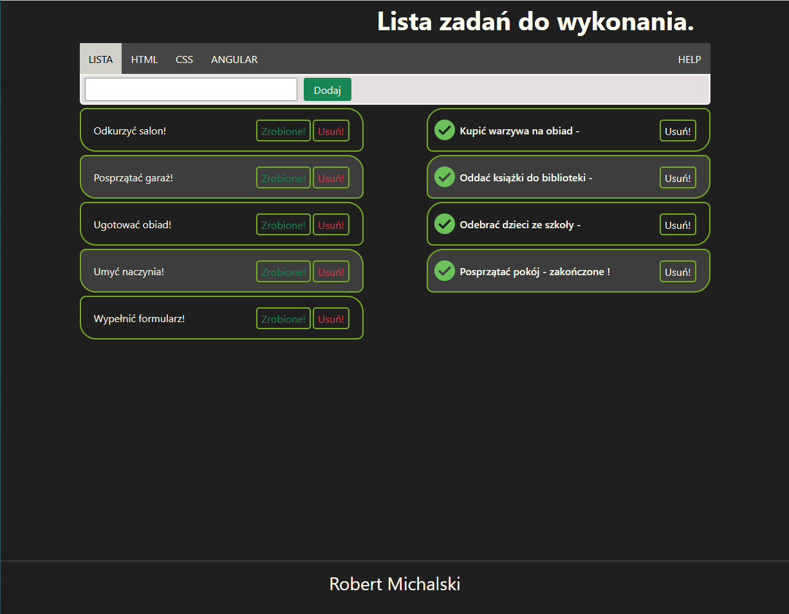
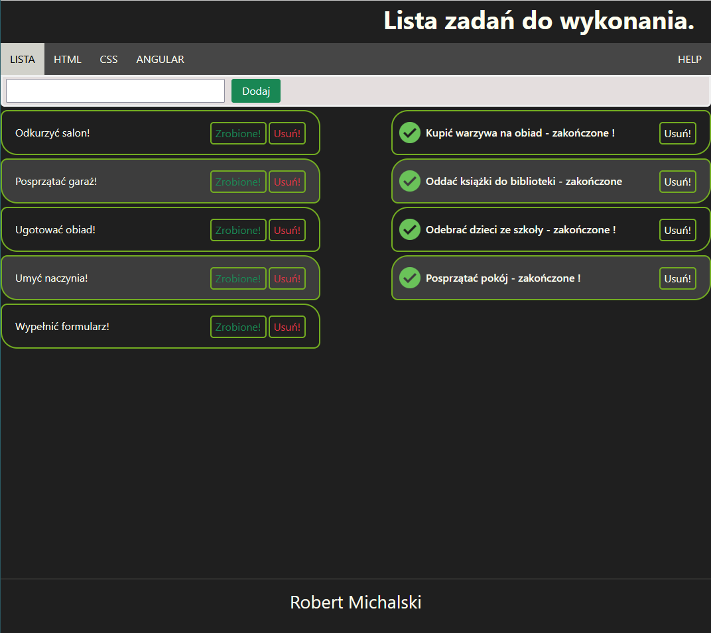
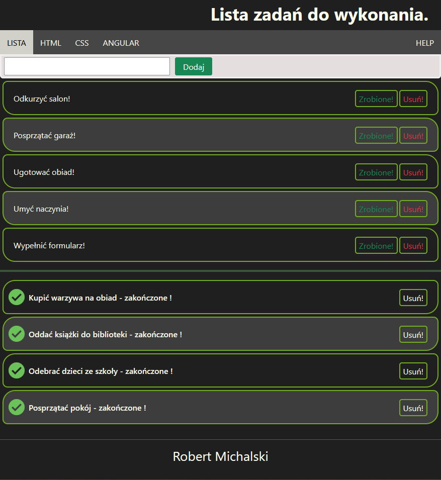
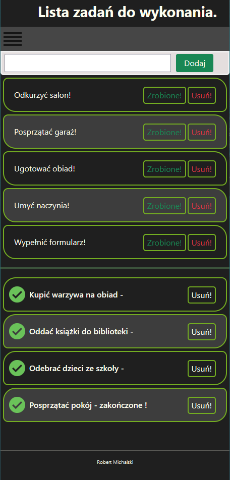
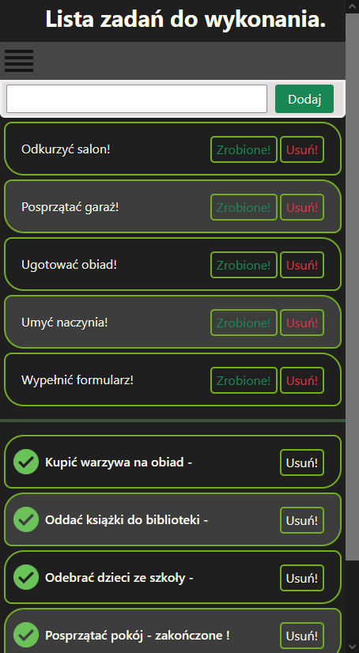

# Projekt prostej listy zadań stworzony do ćwiczeń ze środowskiem Angular.


<br>

## Spis treści <span id="top"></span>

<a href="https://angular.io/"></a>
<div>
  <ol>
    <li><a href="#tech">Technologie</a></li>
    <li>
      <a href="#description">Opis projektu</a>
        <ul>
          <li><a href="#components">Komponenty</a>
            <ul>
              <li><a href="#appcomponent">App.Component</a></li>
              <li><a href="#listcomponent">List.Component</a></li>
              <li><a href="#helpcomponent">Help.Component</a></li>
              <li><a href="#add-taskcomponent">Add-task.Component</a></li>
              <li><a href="#todo-taskcomponent">Todo-task.Component</a></li>
              <li><a href="#done-taskcomponent">Done-task.Component</a></li>
            </ul>
          </li>
          <li><a href="#notasks">Brak zadań</a></li>
          <li><a href="#sticky">Sticky top</a></li>
        </ul>
    </li>
    <li><a href="#service">Serwis HTTP</a></li>
    <li><a href="#reactForms">Reactive Forms</a></li>
    <li><a href="#bootstrap">Bootstrap</a></li>
    <li><a href="#routing">Routing</a></li>
    <li>
        <a href="#res">Responsive Web Design</a>
        <ul>
          <li><a href="#res-zdj">Zdjęcia</a></li>
        </ul>
    </li>
    <li><a href="#directives">Dyrektywy</a></li>
    <li><a href="#pipes">Pipe'y</a></li>
  </ol>
</div>
<br>

<!-- TECHNOLOGIE -->
### Technologie <span id="tech"></span>

* [Angular](https://angular.io) <a href="https://angular.io"></a>
* [Bootstrap](https://getbootstrap.com) <a href="https://getbootstrap.com"></a>
* [Visual Studio Code](https://code.visualstudio.com) <a href="https://code.visualstudio.com"></a>
* [GIT](https://git-scm.com) <a href="https://git-scm.com"></a>
* [Fake Rest API](https://github.com/typicode/json-server#getting-started) <a href="https://github.com/typicode/json-server#getting-started"></a>
<p align="right">(<a href="#top">Do góry!</a>)</p>

<!-- OPIS PROJEKTU -->
## Opis projektu <span id="description"></span>


<p align="center"><small><i>Wygląd strony głównej.</i></small></p>
<br>
<ul>
  <li><a href="#components">Komponenty</a></li>
  <li><a href="#notasks">Brak zadań</a></li>
  <li><a href="#sticky">Sticky top</a></li>
</ul>
<p align="right">(<a href="#top">Do góry!</a>)</p>
<br>

<!-- KOMPONENTY -->
### Komponenty <span id="components"></span>


<p align="center"><small><i>Rozkład komponentów.</i></small></p>

<p align="justify">W celu skupienia uwagi użytkownika obszar wyświetlania informacji został zawężony do 60% szerokości strony (w przypadku wyświetlania na ekranach o rozdzielczości większej niż 1600px szerokości. Zakres ulega zmianom zgodnie z <a href="#res">Responsive Web Design</a>).</p>

<strong>Drzewo komponentów</strong>
<ul>
  <li><a href="#appcomponent">App.Component</a>
    <ul>
    <li><a href="#listcomponent">List.Component</a>
      <ul>
        <li><a href="#add-taskcomponent">Add-task.Component</a></li>
        <li><a href="#todo-taskcomponent">Todo-task.Component</a></li>
        <li><a href="#done-taskcomponent">Done-task.Component</a></li>
      </ul>
    </li>
      <li><a href="#helpcomponent">Help.Component</a></li>
    </li>
  </ul>
</ul>
<p align="right">(<a href="#description">Wyżej</a>)  (<a href="#top">Do góry!</a>)</p>

<br>
<hr>

<!-- APPCOMPONENT -->
#### App.component <span id="appcomponent"></span>
 
<p align="justify">Zawiera trzon projektu i jest rodzicem dla pozostałych komponentów.</p>
<br>

<p>Opisany jest w nim nagłówek:</p>  <span id="header"></span>


```HTML
 <!--app.component.HTML-->

  <div class="header">
    <h1><strong>Lista zadań do wykonania.</strong></h1>
  </div>
```
  
```CSS
  /*app.component.css*/
  
  .header { text-align: right; color: #fffff0; padding: 5px 25px 5px; font-weight: bold; }
```

<br>

<p>Pasek nawigacyjny:</p> <span id="topnavbar"></span>


```HTML
 <!--app.component.HTML-->

<div class="topnavbar" [ngClass]="{ 'MenuShow': bMenuHide === false, 'MenuHide': bMenuHide === true }">
  <button id="Menu" (click)="hideMenu()"></button>
  <a [routerLinkActive]="['active']" routerLink="/Lista">LISTA</a>
</div>
```

<p>Zawiera dyrektywę ngClass, użytą do <a href="res">Responsive design</a>, oraz <a href="routing">AngularRouting</a></p>
  
```CSS
  /*app.component.css*/
  
  .topnavbar { position: -webkit-sticky; position: sticky; top: 0; background-color: #464646;
               overflow: hidden; }
```

<p>Parametr position: sticky użyto do przyczepienia paska do konkretnej pozycji w przypadku scrollowania (więcej w roz. <a href="#sticky">sticky</a>).</p>

<br>

<p>Stopka:</p> <span id="footer"></span>


```HTML
 <!--app.component.HTML-->

<div class="footer"><hr>
  <h3>Robert Michalski</h3><br>
</div>
```

```CSS
  /*app.component.css*/
  
  .footer { text-align: center; position: fixed; bottom: 0px; left: 0px; size: 20px; color: #fffff0; 
            background-color: #1f1f1f; width: 100%;}
```

<p>Przy pomocy position: fixed umocowano stopkę w stałym miejscu okna przeglądarki.</p>

<p align="right">(<a href="#components">Wyżej</a>)  (<a href="#top">Do góry!</a>)</p>
<hr>


<!--LISTCOMPONENT-->
#### list.component <span id="listcomponent"></span>

<p align="justify">Stworzony jako rodzic dla komponentów odpowiedzialnych za funkcjonowanie listy.</p> 

```HTML
 <!--list.component.HTML-->

<div class="AddTask"> <app-add-task></app-add-task> </div>
<div class="maincontent"> 
  <div class="leftcolumn"> <app-todo-task></app-todo-task> </div>
  <hr class="divider" />
  <div class="rightcolumn"> <app-done-task></app-done-task> </div>
</div>
```

```CSS
  /*list.component.css*/
  
  .AddTask { position: -webkit-sticky; position: sticky; top: 48px; }
```

<p align="justify">Position: sticky dba o "przyklejanie" paska AddTask do paska nawigacyjnego podczas przewijania. (<a href="sticky">sticky</a>)</p>
<br>

<p align="justify">Pobiera informacje z <a href="service">serwisu HTTP</a> na temat statusu błędu zapytania serwera. W przypadku negatywnego statusu, korzystając z dyrektywy ngIf, wyświetla komunikat:</p>


<p align="center"><small><i>Brak połączenia.</i></small></p>
<br>

```HTML
 <!--list.component.HTML-->

<span class="httpErrorCode" *ngIf="HttpStatus !== '' ">
  <p style="...">Brak połączenia z bazą danych!</p>
  <p><strong>{{HttpStatus}}</strong></p> ...
</span>
```

```TSX
//list.component.ts

  constructor(private httpservice: HttpService) {
    this.httpservice.getStatus().subscribe((ErrorCode: string) => {
      this.HttpStatus = ErrorCode;
    });
  }
  HttpStatus: string = '';
```

<p align="right">(<a href="#components">Wyżej</a>)  (<a href="#top">Do góry!</a>)</p>
<hr>


<!--ADDTASKCOMPONENT-->
#### add-task.component <span id="add-taskcomponent"></span>

<p align="justify">Komponent odpowiedzialny za dodawanie nowych zadań.</p> 

```HTML
 <!--add-task.component.HTML-->

<div class="bar clearfix">
  <form [formGroup]="registrationForm" (ngSubmit)="onSubmit()">
    <div style="float: left;">
      <input [ngClass]="{'is-invalid': taskName?.invalid && taskName?.touched}" formControlName="taskName">
      <div *ngIf="taskName?.invalid ">
        <small *ngIf="taskName?.errors?.required && taskName?.touched " class="text-danger"><strong>Wprowadź tekst. </strong></small>
        <small *ngIf="taskName?.errors?.forbiddenName" class="text-danger"><strong>Dozwolone są tylko litery i cyfry.</strong></small>
      </div>
    </div>
    <button [disabled]="!registrationForm.valid"  type="button" class="btn btn-success" style="margin-left: 10px;
    padding: 5px 15px;float: left;" type="submit">Dodaj</button>
  </form>
</div>
```

<p align="justify">Dyrektywa ngModel pozwala na ciągłe aktualizowanie wartości zmiennej newTask pomiędzy plikiem zawierającym skrypt i widokiem w przeglądarce.</p>
<p align="justify">Podczas kliknięcia przycisku "Dodaj" lub wciśnięcia klawisza "Enter" wywoływana jest metoda add().</p> 

```TSX
//add-task.component.ts

  add() { let task:Task = {name: this.newTask,
                           created: new Date().toLocaleDateString() + ', '
                           + new Date().toLocaleTimeString(),
                           isDone: false};
    if(task.name !== ''){ this.httpService.addTask(task); }
    this.newTask = ''; }
```

<p align="justify">Metoda add() tworzy zadanie przypisując mu odpowiednie wartości i wysyła je do <a href="service">serwisu HTTP</a>.</p> 

<p align="right">(<a href="#components">Wyżej</a>)  (<a href="#top">Do góry!</a>)</p>
<hr>


<!--TODOTASKCOMPONENT-->
#### todo-task.component <span id="todo-taskcomponent"></span>

<p align="justify">Wyświetla zadania do zrobienia.</p> 

```HTML
 <!--todo-task.component.HTML-->

<div *ngIf="tasksList.length > 0; else noTask"><ul><li
      appDate
      [dateCreated]="task.created"
      *ngFor="let task of tasksList | sortName; let odd = odd"
      [ngClass]="{ 'odd-li': odd === true, 'last-li': tasksList.length === 1 }">
      <p>{{ task.name | transformTask: "!" }}</p> ... <br> </li> </ul>
</div>

```

<p align="justify">Dyrektywa ngFor pozwala na powielanie zawartości (div) dla każdego obiektu zadania (task).</p>
<p align="justify">Dodatkowo wykorzystano tutaj dwie funkcjonalności środowiska Angular. Mianowicie <a href="directives">dyrektywy</a> oraz <a href="pipes">pipe'y</a>.</p>


```TSX
//todo-task.component.ts

  constructor(private httpService: HttpService) {
    httpService.getTaskListObs().subscribe((tasks: Array<Task>) => {
      this.tasksList = tasks.filter((e) => e.isDone === false);
    });
  }
  tasksList: Array<Task> = [];
  
  removeTask(task: Task) { this.httpService.deleteTask(task); }

  doneTask(task: Task) { this.httpService.updateTask(task); }
```

<p align="justify">Podczas tworzenia obiektu todo-task wywoływana jest subskrybcja listy obiektów task z <a href="service">serwisu HTTP</a>.
Metoda removeTask() przesyła do <a href="service">serwisu HTTP</a> zadanie oznaczone do usunięcia, natomiast metoda doneTask() wysyła zadanie do zatwierdzenia.</p> 

<p align="right">(<a href="#components">Wyżej</a>)  (<a href="#top">Do góry!</a>)</p>
<hr>


<!--DONETASKCOMPONENT-->
#### done-task.component <span id="done-taskcomponent"></span>

<p align="justify">Wyświetla ukończone zadania.</p> 

```HTML
 <!--done-task.component.HTML-->

<div *ngIf="tasksDone.length > 0; else noTask"><ul><li
      appChecked
      ...
      <p>{{ task.name | transformTask: " - zakończone !" }}</p> ... <br/> </li> </ul>
</div>

```

<p align="justify">W komponencie donetask dodatkowo używamy <a href="#directives">dyrektywy</a> appChecked żeby wyróżnić zakończone zadania.</p>


```TSX
//done-task.component.ts

  constructor(private httpService: HttpService) {
    httpService.getTaskListObs().subscribe((tasks: Array<Task>) => {
      this.tasksList = tasks.filter((a) => a.isDone === true);
    });
  }
  tasksDone: Array<Task> = [];
```

<p align="justify">Podczas tworzenia obiektu done-task wywoływana jest subskrybcja listy obiektów task z <a href="service">serwisu HTTP</a>.</p> 

<p align="right">(<a href="#components">Wyżej</a>)  (<a href="#top">Do góry!</a>)</p>
<hr>


<!--HELPCOMPONENT-->
#### help.component <span id="helpcomponent"></span>

<p align="justify">Zawiera informacje na temat sposobu podłączenia do Fake Rest Api.</p> 


<p align="center"><small><i>Widok strony z pomocą.</i></small></p>
<br>

<p align="right">(<a href="#components">Wyżej</a>)  (<a href="#top">Do góry!</a>)</p>
<br>


<!--BRAKZADAN-->
### Brak zadań <span id="notasks"></span>


<p align="center"><small><i>Wygląd w przypadku braku zadań.</i></small></p>

<br>
<p align="justify"> Przy pomocy instrukcji warunkowej ngIf sprawdzamy czy dostępne są zadania. W przypadku gdy lista zadań jest pusta, w miejscu listy wyświetlany jest template zadeklarowany w (ng-template).</p>
<br>

```HTML
 <!--todo-task.component.HTML-->

  <div *ngIf="tasksList.length > 0; else noTask">
    ...
  </div>

  <ng-template #noTask>
    <p style="...">Brak wykonanych zadań</p>
  </ng-template>
```

<p align="right">(<a href="#description">Wyżej</a>)  (<a href="#top">Do góry!</a>)</p>
<br>


<!--Sticky TOP-->
### Sticky top <span id="sticky"></span>


<p align="center"><small><i>Sticky topnavbar.</i></small></p>
<br>
<p align="justify"><a href="topnavbar">Pasek nawigacyjny</a> oraz <a href="listcomponent">pasek addTask</a> korzystają z atrybutu position: sticky. Pozwala to na przyklejenie określonej zawartości do konkretnego punktu na ekranie przeglądarki. W momencie przewijania zawartość zatrzymuje się na tej pozycji. Pozwala to na zachowanie widocznym istotnych dla użytkownika funkcji podczas pracy np. z długą listą.</p> 


<p align="right">(<a href="#description">Wyżej</a>)  (<a href="#top">Do góry!</a>)</p>
<br>


<!--SERWISHTTP-->
## Serwis HTTP <span id="service"></span>

<br>

```TSX
//http.service.ts

  private taskListObs = new BehaviorSubject<Array<Task>>([]);
  tasks$ = this.taskListObs.asObservable();

  private status = new BehaviorSubject<string>('');
  status$ = this.status.asObservable();
  
  getStatus(): Observable<string> { return this.status$; }

  getTaskListObs(): Observable<Array<Task>> { return this.tasks$; }
```

<p align="justify">Zadeklarowano zmienne taskListObs oraz status typu BehaviourSubject z biblioteki rxjs. Dzięki temu kod nie jest wywoływany osobno dla każdego subskrybenta. Następnie stworzone zostały na ich podstawie zmienne tasks$ oraz status$, które zadeklarowane zostały jako obserwowalne. Metody getStatus() oraz getTaskListObs() po wywołaniu przez komponent korzystający z serwisu zwracają wartości obserwowanych zmiennych, a właściwości typu Observable dbają o ciągła aktualizację tej wartości.</p>
<br>

```TSX
//http.service.ts

  getTasks() {
    this.http.get<Array<Task>>('http://localhost:3000/posts').subscribe(
      (tasks) => {
        this.taskListObs.next(tasks);
      },
      (error) => {
        this.status.next(error.name);
        //console.log('getTasks ' + error.name);
      },
      () => {this.status.next('')}
    );
  }
```

<p align="justify">Metoda getTask() odpowiada za pobieranie listy zadań z FakeRestAPI. Wywoływana jest ona przy tworzeniu obiektu. Na adres 'http://localhost:3000/posts' wysyłane jest zapytanie GET. Do zmiennej taskListObs przypisywane są uzyskane wartości, do zmiennj status przypisywany jest komunikat błędu, jeśli zapytanie zakończyło się sukcesem do zmiennej status przypisujemy pustego stringa.</p>
<br>

```TSX
//http.service.ts

  addTask(task: Task) {
    //console.log('AddTask ' + task.name);
    this.http.post<Task>('http://localhost:3000/posts', task).subscribe(
      () => {},
      (error) => {this.status.next(error.name);},
      () => {this.getTasks();}
    );
  }
```

<p align="justify">Metoda addTask() dodaje do listy 'posts' kolejny obiekt typu task. W przypadku pomyślnego zakończenia zapytania zostaje wywołana metoda getTask() która aktualizuje wyświetlaną listę.</p>

<p align="right">(<a href="#top">Do góry!</a>)</p>
<br>


<!-- Reactive Forms -->
## Reactive Forms <span id="reactForms"></span>


<p align="center"><small><i>Komunikat w przypadku pustego pola tekstowego.</i></small></p>
<br>


<p align="center"><small><i>Komunikat w przypadku wprowadzenia niedozwolonych znaków.</i></small></p>
<br>

```HTML
<!--add-task.component.HTML-->

<div ...>
  <form [formGroup]="addtaskForm" (ngSubmit)="onSubmit()">
    <div ....>
      <input [ngClass]="{'is-invalid': taskName?.invalid && taskName?.touched}" formControlName="taskName">
      <div *ngIf="taskName?.invalid ">
        <small *ngIf="taskName?.errors?.required && taskName?.touched " class="text-danger"><strong>Wprowadź tekst. </strong></small>
        <small *ngIf="taskName?.errors?.forbiddenName" class="text-danger"><strong>Dozwolone są tylko litery i cyfry.</strong></small>
      </div>
    </div>
    <button [disabled]="!addtaskForm.valid" ... type="submit">Dodaj</button>
  </form></div>
```

```TSX
//add-task.component.ts

ngOnInit(): void {
    this.addtaskForm = this.formbuilder.group({
      taskName: ['', [Validators.required, Validators.minLength(1), forbiddensignValidator(/[`\-~!@#$%^&*()_+={}\[\]|\\:\'\/\";“’<,>.?๐฿]+/)]]
    })}
    
```

<p align="justify">Przy użyciu formbuilder została stworzona form grupa o nazwie ( addtaskForm ). Do tej grupy dodany został FormControl o nazwie taskName. Dla zmiennej ustawiona została kontrola walidacji. Jako warunki przyjęto łańcuch o długości przynajmniej jednego znaku oraz funkcję forbiddensignValidator.</p>

```TSX
//new-task.validator.ts

import { AbstractControl, ValidatorFn } from "@angular/forms";

export function forbiddensignValidator(forbiddenName : RegExp) :ValidatorFn {
  return (control : AbstractControl) : any | null => {
    const forbidden : boolean = forbiddenName.test(control.value);
    return forbidden ? {'forbiddenName':{value: control.value}} : null;
}}
```

<p align="justify">Funckcja forbiddensignValidator jako argument przyjmuje regular expression. Jeśli tekst nie zawiera znaków wprowadzonych w regexp, zwracany jest null i formcontrol przechodzi do wartości VALID.</p>

<p align="right">(<a href="#top">Do góry!</a>)</p>
<br>


<!-- BOOTSTRAP -->
## Bootstrap <span id="bootstrap"></span>

<p align="justify">Dzięki wykorzystaniu biblioteki bootstrap, w łatwy i szybki sposób zaimplementowano animowane przyciski do wywoływania eventów.</p>
<br>

<p><strong>Zakończenie zadania.</strong></p>
<hr>


```HTML
<!--todo-task.component.HTML-->

  <li>
    <button type="button" 
     class="btn btn-outline-success" 
     style="..." 
     (click)="doneTask(task)">Zrobione!</button>
  </li>
```

<br content="" display="table" clear="both">
<br>

<p><strong>Usunięcie zadania.</strong></p>
<hr>


```HTML
<!--todo-task.component.HTML-->

  <li>
    <button type="button" 
     class="btn btn-outline-danger" 
     style="..." 
     (click)="removeTask(task)">Usuń!</button>
  </li>
```

<br content="" display="table" clear="both">
<br>

<p><strong>Usunięcie zakończonego zadania.</strong></p>
<hr>


```HTML
<!--done-task.component.HTML-->

  <li>
    <button type="button" 
     class="btn btn-outline-light" 
     style="..." 
     (click)="removeTask(task)">Usuń!</button>
  </li>
```

<br content="" display="table" clear="both">
<br>

<p align="right">(<a href="#top">Do góry!</a>)</p>
<br>


<!-- ROUTING -->
## Routing <span id="routing"></span>


<p align="center"><small><i>Zmiana komponentu przy pomocy Angular Routing.</i></small></p>
<br>

```HTML
<!--app.component.HTML-->

<div ... >
  ...
  <a [routerLinkActive]="['active']" routerLink="/Lista">LISTA</a>
  ...
  <a [routerLinkActive]="['active']" routerLink="/Help">HELP</a>
</div>

<router-outlet></router-outlet>
```

```TSX
//app-routing.module.ts

const routes: Routes = [
  { path: '', redirectTo: 'Lista', pathMatch: 'full' },
  { path: 'Lista', component: ListComponent },
  { path: 'Help', component: HelpComponent },
  { path: '**', component: ListComponent },  // Wildcard route for a 404 page
];

```

<p align="justify">Do nawigacji pomiędzy głównymi komponentami wykorzystano bibliotekę angular routing. W tym przypadku, zamiast umieszczania selector'a z dekoratora komponentu który chcemy umieścić, wstawiamy selector (router-outlet). Pozwala nam to na dynamiczną podmianę komponentu. Właściwość "[routerLinkActive]="['active']" przypisuje wybraną klasę CSS w przypadku gdy dany link został aktywowany. Ścieżka '**' dodana zostało do obsługi pozostałych linków, tak aby w przypadku gdy użytkownik z poziomu pola adresu przeglądarki wpisze nieistniejącą ścieżkę zostanie przekierowany do strony głównej. W tym przypadku list.component.</p>

<p align="right">(<a href="#top">Do góry!</a>)</p>
<br>


## Responsive Web Design <span id="res"></span>


<p align="center"><small><i>Responsywność strony.</i></small></p>
<br>

<p align="justify">Zachowanie serwisu zostało dopasowane tak, aby cała zawartość pozostawała czytelna niezależnie od rozdzielczości ekranu. Dzięki temu będzie on wygodny w obsłudze nawet na starszych monitorach oraz na mniejszych urządzeniach.</p>

<p align="right">(<a href="#top">Do góry!</a>)</p>
<br>

### Responsive Web Design - Zdjęcia <span id="res-zdj"></span>

<hr>




<br content="" display="table" clear="both">
<br>
<p align="center"><small><i>Stopnie składania Responsive Design.</i></small></p>

<hr>




<br content="" display="table" clear="both">
<br>
<p align="center"><small><i>Rozwijane Menu i znikająca stopka.</i></small></p>
<br>
<p align="right">(<a href="#res">Wyżej</a>)  (<a href="#top">Do góry!</a>)</p>
<br>


<!-- DYREKTYWY -->
## Dyrektywy <span id="directives"></span>


<br content="" display="table" clear="both">
<br>
<p align="center"><small><i>Zastosowanie dyrektywy do wyświetlania dat.</i></small></p>
<br>

```HTML
<!--done-task.component.HTML-->

<div ... ><ul>
    <li ... appDate [dateCreated]="task.created" [dateEnd]="task.end" ... >
      <p>{{ task.name ...}}</p>
      ...
    </li></ul></div>
```

```TSX
//date.directive.ts

  @Input()
  public dateEnd !: string | undefined;

  @Input()
  public dateCreated !: string | undefined;

  private paragraphCreated :any;
  private paragraphEnd :any;
  
  constructor(private el:ElementRef, private renderer:Renderer2) {
    this.paragraphCreated = renderer.createElement('p');
    this.paragraphEnd = renderer.createElement('p');
  }

  @HostListener('mouseenter')
  mouseenter(e:MouseEvent){
    this.paragraphCreated.innerHTML = 'Dodano ' + this.dateCreated;
    this.renderer.appendChild(this.el.nativeElement,this.paragraphCreated);
    if(this.dateEnd !== undefined || null){
      this.paragraphEnd.innerHTML = 'Zakończono ' + this.dateEnd;
      this.renderer.appendChild(this.el.nativeElement,this.paragraphEnd);
    }
  }
  
```

<p align="justify">Ustawiamy zmienne dateEnd i dateCreated jako pobierające wartość z nadrzędnego komponentu. W konstruktorze, do zmiennych paragraph, przypisujemy właściwości elementu ( (p) HTML ). Dekorator @HostListener sprawdza czy wystąpił event 'mouseenter' dla elementu nadrzędnego. Jeśli tak się stanie, wywoływana jest metoda mouseenter(e) w której następuje stworzenie paragrafu o treści "Dodano 'data dodania'", a następnie przypisanie go do elementu ( li ) w którym została użyta dyrektywa. W przypadku gdy obiekt task posiada datę zakończenia, tworzony jest również drugi paragraf z jej datą.</p>

<p align="right">(<a href="#top">Do góry!</a>)</p>
<br>


<!-- PIPE'Y -->
## Pipe'y <span id="pipes"></span>


<p align="center"><small><i>Sortowanie w porządku alfabetycznym.</i></small></p>
<br>

```HTML
<!--done-task.component.HTML-->

<div ... ><ul>
    <li ... *ngFor="let task of tasksDone | sortName; ... ">
      <p>{{ task.name ...}}</p>
      ...
    </li></ul></div>
```

```TSX
//sort-name.pipe.ts

  transform(value: Array<Task>, ...args: unknown[]): Array<Task> {
    return value.sort(
      (a,b) => {
        if(a.name.toLowerCase() > b.name.toLowerCase()) {return 1;}
        else {return -1;}
      });
  } 
```

<p align="justify">Tablica obiektów taskDone zostaje 'przepuszczona' przez pipe w którym następuje sortowanie. Metoda transform() pobiera całą tablicę, porównuje kolejne kody ASCII znaków, odpowiednio ją sortuje i zwraca ją w postaci referencji. </p>

<p align="right">(<a href="#top">Do góry!</a>)</p>
<br>


# ProjektListaZadan

This project was generated with [Angular CLI](https://github.com/angular/angular-cli) version 12.0.3.

